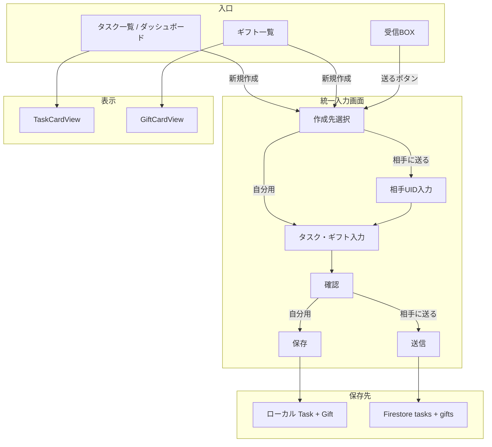
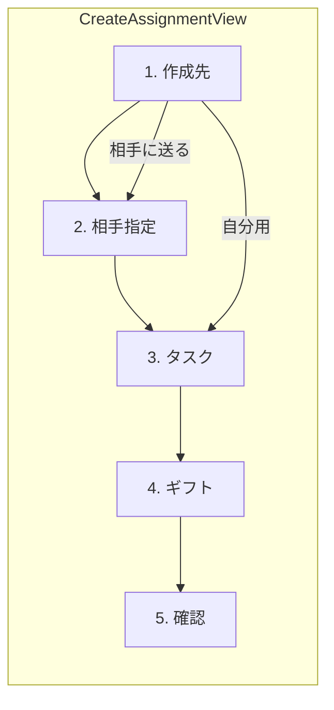
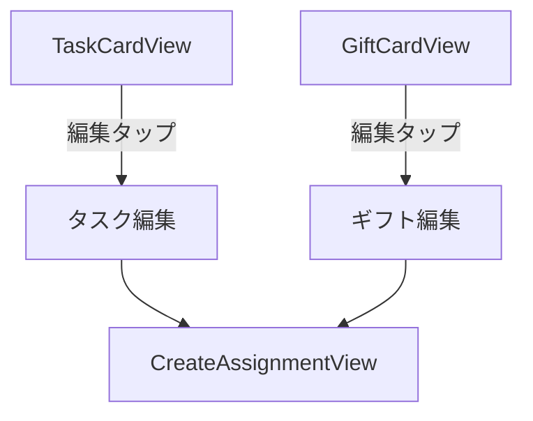

# 統一入力画面 — 追加フィールド一覧・画面遷移・保存時バリデーション仕様

実装時にそのまま参照できるよう、**追加フィールド（モデル / Firestore）**・**画面遷移**・**保存時バリデーション**を具体化した仕様です。

---

## 1. 追加フィールド一覧

### 1-1. Task（Swift モデル・ローカル / UserDefaults）

| フィールド名 | 型 | 追加/既存 | 説明 |
|--------------|-----|-----------|------|
| createdByUserId | String? | **追加** | 作成者UID。自分用タスク作成時に `Auth.currentUser.uid` を保存。届いたタスクは nil（表示は senderId を使用）。編集可否は `createdByUserId == currentUser?.uid` で判定。 |
| createdByUserName | String? | **追加** | 作成者表示名。自分用作成時に `userProfile.displayName` を保存。届いたタスクは nil（表示は senderName を使用）。 |

**既存フィールドで役割を変えないもの**:  
`title`, `description`, `dueDate`, `priority`, `verificationMode`, `rewardDisplayName`, `senderId`, `senderName`, `rewardId`, `targetDays`, `currentCount`, `lastCompletedDate` 等は現状どおり。

---

### 1-2. Firestore `tasks` コレクション

| フィールド名（Firestore） | 型 | 追加/既存 | 説明 |
|---------------------------|-----|-----------|------|
| created_by_uid | string | **追加（任意）** | 作成者UID。送信時は `sender_id` と同一にしても可。ローカルと揃えるなら送信時に同じ値を入れる。 |
| created_by_name | string | **追加（任意）** | 作成者表示名。送信時は `sender_name` と同一で可。 |
| due_date | timestamp | **追加（任意）** | タスク期限。既存にない場合、送信フローで期限を渡すなら追加。日付のみなら startOfDay で保存。 |

**既存のまま使用**:  
`id`, `title`, `sender_id`, `receiver_id`, `status`, `reward_id`, `gift_name`, `target_days`, `current_count`, `sender_name`, `sender_emoji`, `sender_total_completed_count`, `last_completed_date`, `completion_image_url`。

**注意**: `created_by_*` を Firestore に持たない場合は、表示時は「送信タスク = sender_id / sender_name を作成者とする」と決めておく。

---

### 1-3. Gift（Swift モデル・ローカル / UserDefaults）

| フィールド名 | 型 | 追加/既存 | 説明 |
|--------------|-----|-----------|------|
| createdByUserId | String? | **追加** | 作成者UID。自分用ギフト作成時に `Auth.currentUser.uid` を保存。相手から受け取ったギフトは nil（表示は assignedFromUserId を使用）。 |
| createdByUserName | String? | **追加** | 作成者表示名。自分用作成時に `userProfile.displayName` を保存。 |
| linkedTaskTitle | String? | **追加（任意）** | 紐づくタスク名（表示用）。未設定なら taskId から Task を検索して表示。 |
| linkedTaskDueDate | Date? | **追加（任意）** | 紐づくタスクの期限（表示用）。同上。 |

**既存**:  
`description` を「ギフトの詳細情報」として利用し、**入力・表示時に 40 文字制限**をかける（後述バリデーション）。

---

### 1-4. Firestore `gifts` コレクション

| フィールド名（Firestore） | 型 | 追加/既存 | 説明 |
|---------------------------|-----|-----------|------|
| description | string | **追加（任意）** | ギフト詳細（40文字以内）。送信フローで渡す場合。 |
| created_by_uid | string | **追加（任意）** | 作成者UID。送信時は送信者UID。 |
| created_by_name | string | **追加（任意）** | 作成者表示名。 |
| task_title | string | **追加（任意）** | 紐づくタスク名（表示用）。 |
| task_due_date | timestamp | **追加（任意）** | 紐づくタスクの期限。 |

**既存のまま使用**:  
`id`, `name`, `is_unlocked`, `associated_task_id`。

---

### 1-5. フィールド対応表（表示用の共通化）

| 表示項目 | タスク側で参照するフィールド | ギフト側で参照するフィールド |
|----------|------------------------------|------------------------------|
| 作成者名 | `createdByUserName ?? senderName ?? fromDisplayName` | `createdByUserName ?? assignedFromUserName` |
| 編集可能か | `createdByUserId == currentUser?.uid` または（届いたタスクでないなら `senderId == nil` かつ作成者=自分） | `createdByUserId == currentUser?.uid` |
| 期限 | `task.dueDate` | 紐づく Task の `dueDate` または `linkedTaskDueDate` |
| 紐づくタスク名 | — | `linkedTaskTitle` または `taskId` から Task を取得 |
| 紐づくギフト名 | `rewardDisplayName` | — |
| ギフト詳細（40文字） | — | `gift.description`（40文字制限） |

---

## 2. 画面遷移図

### 2-1. 全体フロー（Mermaid）

### 2-2. 統一入力画面（CreateAssignmentView）の内部構成

- **1. 作成先**: セグメントまたはボタンで「自分用」／「相手に送る」を選択。
- **2. 相手指定**: 「相手に送る」のときのみ表示。相手UID（手入力 or フレンド一覧）。
- **3. タスク**: タスク名、期限（DatePicker）、達成条件（自己申告/証拠写真）、優先度。
- **4. ギフト**: ギフト名、ギフト詳細（40文字以内テキスト）。
- **5. 確認**: 入力内容サマリ + 「保存」／「送信」ボタン。

### 2-3. カードからの編集遷移

- 編集時は `CreateAssignmentView(editingTask: task)` または `CreateAssignmentView(editingGift: gift)` で開き、作成先は編集不可（既存の自分用/送信済みを維持）。

---

## 3. 保存時バリデーション仕様

### 3-1. 共通ルール

| 項目 | ルール | エラー表示例 |
|------|--------|----------------|
| タスク名 | 必須。空白のみ不可。前後空白は trim。 | 「タスク名を入力してください」 |
| ギフト名 | 必須（相手に送る場合は既存どおり）。自分用も必須とする場合あり。空白のみ不可。 | 「ギフト名を入力してください」 |
| 相手UID | 「相手に送る」のとき必須。空・空白のみ不可。 | 「送信先のユーザーIDを入力してください」 |
| ギフト詳細 | 任意。入力時は **40 文字以内**。超過分は保存時に切り捨てまたは入力拒否。 | 「詳細は40文字以内で入力してください」 |

---

### 3-2. 自分用（ローカル保存）のバリデーション

| 項目 | 条件 | 備考 |
|------|------|------|
| タスク名 | 必須、1文字以上（trim 後） | 既存 createTask と同様 |
| 期限 | 任意（nil 可） | 未設定時はカードで「期限なし」等と表示 |
| 達成条件 | 自己申告 / 証拠写真のいずれか | 既存 enum のまま |
| 優先度 | 低/中/高/緊急のいずれか | 既存 enum のまま |
| ギフト名 | 任意または必須（ product 方針で決定） | 任意なら空文字可 |
| ギフト詳細 | 0〜40 文字 | 41 文字目は保存しない or 入力不可 |

**保存処理**  
- `TaskViewModel.createTask(...)` に `createdByUserId`, `createdByUserName` を渡す。  
- ギフトを同時に作る場合、`GiftViewModel` に `createdByUserId`, `createdByUserName`, `description`（40文字制限済み）を渡す。  
- 日付は `Date` のまま保存。表示時のみ `yyyy/MM/dd` でフォーマット。

---

### 3-3. 相手に送る（Firestore 保存）のバリデーション

| 項目 | 条件 | 備考 |
|------|------|------|
| タスク名 | 必須、1文字以上（trim 後） | 既存 sendTask と同様 |
| ギフト名 | 必須、1文字以上（trim 後） | 既存 sendTask と同様 |
| 相手UID | 必須、1文字以上（trim 後） | 既存 sendTask と同様 |
| 目標日数 | 1〜30（未指定時 1） | 既存どおり |
| ギフト詳細 | 0〜40 文字 | Firestore に `description` を追加する場合 |
| 期限 | 任意（Firestore に `due_date` を追加する場合） | 送信時に渡すなら Date → Timestamp |

**保存処理**  
- `TaskRepository.sendTask(...)` の引数を拡張する場合: `giftDescription: String?`, `dueDate: Date?` を追加。  
- `taskData` に `due_date`（Timestamp）、`created_by_uid` / `created_by_name`（任意）を追加。  
- `giftData` に `description`（40文字以内）, `created_by_uid`, `created_by_name`, `task_title`, `task_due_date`（任意）を追加。  
- 既存の `sender_id`, `receiver_id`, `reward_id`, `gift_name` 等は変更しない。

---

### 3-4. 編集時のバリデーション

- 上記と同じルール（タスク名必須、ギフト詳細40文字以内など）を編集フォームにも適用する。
- **編集可能なのは「作成者のみ」**:
  - タスク: `task.createdByUserId == currentUser?.uid` または（届いたタスクでない `senderId == nil` かつ自分が作成）。
  - ギフト: `gift.createdByUserId == currentUser?.uid`。
- 届いたタスク（`senderId != nil`）は送信者側でも Firestore 更新は「承認/差し戻し」のみとし、通常の編集は行わない方針とする。

---

### 3-5. 日付フォーマット（表示のみ）

- **表示**: `yyyy/MM/dd`（例: 2026/03/15）。
  `DateFormatter` で `dateFormat = "yyyy/MM/dd"` を指定。
- **保存**: `Date`（ローカル）/ `Timestamp`（Firestore）のまま。  
  時刻は使わない場合は `Calendar.startOfDay` で 0 時にして保存してもよい。

---

## 4. 実装時のチェックリスト（抜粋）

- [ ] Task に `createdByUserId`, `createdByUserName` を追加（Codable 含む）。
- [ ] Gift に `createdByUserId`, `createdByUserName` を追加。`description` の 40 文字制限を UI と保存の両方で実施。
- [ ] （任意）Gift に `linkedTaskTitle`, `linkedTaskDueDate` を追加し、表示で利用。
- [ ] Firestore: （任意）`tasks` に `created_by_uid`, `created_by_name`, `due_date` を追加。`gifts` に `description`, `created_by_uid`, `created_by_name`, `task_title`, `task_due_date` を追加。
- [ ] 統一入力画面 `CreateAssignmentView`: 作成先選択 → 相手指定（条件付き）→ タスク → ギフト → 確認 → 保存/送信。
- [ ] TaskCardView: タスク名・ギフト名・期限（yyyy/MM/dd）・達成条件・作成者・優先度・編集ボタン（作成者のみ表示）。
- [ ] GiftCardView: ギフト名・タスク名・期限・詳細（40文字）・作成者・ロック表示・「ロック中」/「見る」「使う」ボタン。
- [ ] バリデーション: 上記「3. 保存時バリデーション仕様」を保存処理と編集フォームの両方に適用。
- [ ] 既存の AddTaskView / SendTaskView / AddGiftView は、統一画面に置き換えたあと削除または非表示にする。

---

以上で「追加フィールド一覧（モデル/Firestore）＋画面遷移図＋保存時バリデーション仕様」を具体化しています。実装時はこのドキュメントに沿って進めれば、そのまま実装可能です。
